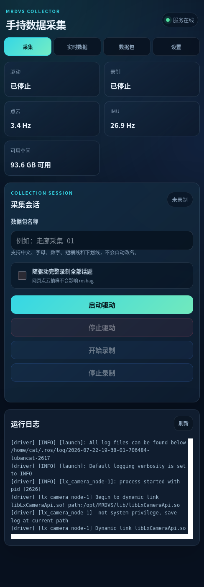
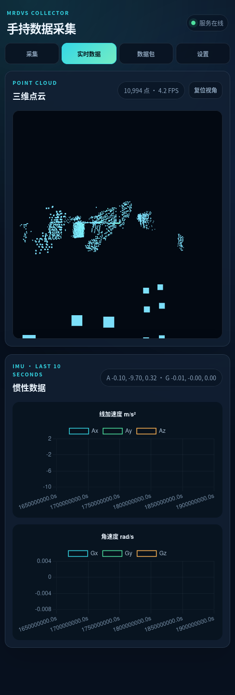
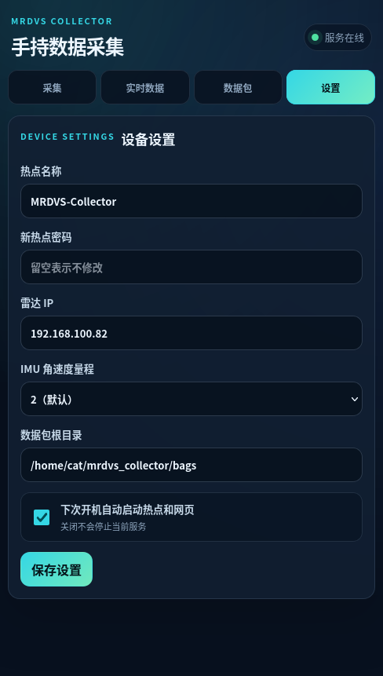

# mrdvs_ros2_ws

## 工具用途

这是一个 ROS2 工作空间，主要包含 `lx_camera_ros` 包，用于接入蓝芯 MRDVS / Lx Camera SDK，构建相机、障碍物、托盘识别、定位和传感器仿真相关节点；同时集成了 `fastlio2` 主里程计包，用于尝试用 MRDVS 的 LiDAR 点云和 IMU 跑 FAST-LIO2。

## 核心逻辑

- `lx_camera_ros` 通过 `ament_cmake` 构建。
- `CMakeLists.txt` 生成自定义 `msg` 和 `srv` 接口，编译 `lx_camera_node`、`lx_localization_node`、`sensor_sim_node`。
- 相机 SDK 头文件和动态库默认来自 `/opt/MRDVS/include` 与 `/opt/MRDVS/lib`。
- `launch/` 提供相机、雷达、障碍物、托盘、定位、建图、传感器仿真等启动入口。
- 根目录脚本提供常用构建和话题查看命令。
- `fastlio2` 来自 `liangheming/FASTLIO2_ROS2` 的主里程计包；回环作为独立 `pgo` 包接入，本工作空间仍不接入 HBA、localizer 等其他额外模块。
- `fastlio2` 已从 Livox `CustomMsg` 适配为标准 `sensor_msgs/msg/PointCloud2` 输入，读取 MRDVS LiDAR 模式下的 `x/y/z/intensity/timestamp` 字段，并把点时间换算为 FAST-LIO2 去畸变所需的帧内相对毫秒。
- MRDVS IMU SDK 输出单位已经是 `m/s^2` 和 `rad/s`，因此 `fastlio2` 中不再对线加速度额外乘以 10。
- `pgo` 与 `interface` 来自同一上游仓库的提交 `f516daa`；PGO 同步 FAST-LIO2 的机体系点云和局部里程计，沿用位置候选、ICP、GTSAM/iSAM2 流程，通过 `map -> lio_local` 在线修正全局位姿，并提供优化地图保存服务。

## MRDVS 手持数据网页采集程序

### 程序介绍

`tools/mrdvs_collector` 是部署在鲁班猫上的手机端 ROS 2 数据采集控制台。设备在无路由器、无显示器的现场也能创建独立 Wi-Fi 热点，操作者连接热点后即可通过浏览器完成以下工作：

- 启动和停止一个 ROS 2 设备驱动；
- 在启动驱动前预先开启 rosbag，完整录制驱动会话中的全部普通和隐藏话题；
- 自定义数据包名称，不覆盖同名数据；
- 查看原始话题频率、三维点云显示副本和最近 10 秒 IMU 曲线；
- 查看有限长度的驱动、rosbag 和系统日志；
- 下载或二次确认删除已经完成的数据包；
- 设置热点、设备参数、数据目录，以及下次开机是否自动启动热点和网页；
- 在剩余空间低于 5GB 时优雅停止 rosbag，等待 MCAP 元数据落盘。

首版已经接入 MRDVS LiDAR 驱动，但控制器的核心职责是“拉起一个设备驱动并完整录包”。文档后面的[通用设备驱动接入与 AI 修改规则](#通用设备驱动接入与-ai-修改规则)说明了如何替换为其他 ROS 2 设备驱动。点云和 IMU 可视化是可选适配，不是完整录包的前提。

### 系统组成与数据流

```text
手机浏览器
  ├─ REST API：驱动、录包、数据包、设置和日志控制
  └─ WebSocket：经过限频/限点的点云与 IMU 显示副本
                         │
                         ▼
                mrdvs-web-console（cat 用户）
                  ├─ 设备驱动子进程
                  ├─ ros2 bag record 子进程 ──► 完整 MCAP 数据包
                  └─ rclpy 只读订阅 ──────────► 网页显示副本
```

rosbag 子进程和网页可视化桥相互独立。浏览器断开、显示限频或丢弃旧显示帧都不会给 rosbag 施加采样或背压。

### 实际页面

以下截图来自鲁班猫上实际运行的移动端页面。截图时未开始新的录制；实时页保留了最近一次设备数据的显示帧。

<table>
  <tr>
    <th>采集控制与运行日志</th>
    <th>点云与 IMU 实时数据</th>
  </tr>
  <tr>
    <td></td>
    <td></td>
  </tr>
  <tr>
    <th>数据包管理</th>
    <th>设备设置</th>
  </tr>
  <tr>
    <td></td>
    <td></td>
  </tr>
</table>

### 鲁班猫部署结构

网页程序与 ROS 2 工作空间分开部署，避免运行数据污染驱动源码：

```text
/home/cat/mrdvs_collector/
├── app/       # 从本仓库 tools/mrdvs_collector 同步的应用源码
├── .venv/     # Python 虚拟环境，通过 system-site-packages 使用 rclpy
├── config/    # 持久化设置
├── state/     # 数据包状态等运行状态
└── bags/      # 默认 MCAP 数据包根目录

/home/cat/mrdvs_ros2_ws/
└── install/   # 当前 MRDVS 驱动 ROS 2 underlay
```

默认网络如下：

| 用途 | 接口或地址 | 说明 |
| --- | --- | --- |
| 手机热点 | `wlan0` / `10.42.0.1` | SSID `MRDVS-Collector`，初始密码 `12345678` |
| USB 网口 SSH/导出 | `eth1` / `192.168.100.100` | 电脑端当前使用 `192.168.100.99` |
| 板载设备网口 | `eth0` / `192.168.100.66` | 当前 MRDVS 设备地址为 `192.168.100.82` |
| 网页 | `http://10.42.0.1` | 仅监听热点地址的 80 端口 |

### 首次部署或更新

先通过 USB 网口把应用同步到独立目录，不复制本机的虚拟环境、Node.js 依赖或缓存：

```bash
ssh cat@192.168.100.100 'mkdir -p /home/cat/mrdvs_collector/app'

rsync -avh --delete \
  --exclude='.venv/' \
  --exclude='node_modules/' \
  --exclude='.pytest_cache/' \
  --exclude='__pycache__/' \
  --exclude='*.egg-info/' \
  tools/mrdvs_collector/ \
  cat@192.168.100.100:/home/cat/mrdvs_collector/app/
```

再在鲁班猫上执行幂等安装器：

```bash
ssh -t cat@192.168.100.100
cd /home/cat/mrdvs_collector/app
bash deploy/install_lubancat.sh
```

压缩 RGB 录制依赖 ROS 2 的 `image_transport` 和 `compressed_image_transport`。安装器会在修改系统前检查这两个包；如果提示缺少 compressed 插件，可先通过鲁班猫的 ROS 软件源安装 `ros-jazzy-compressed-image-transport`，再重新运行安装器。

安装器创建 ARM64 虚拟环境、安装 Python 包、校验 sudoers、安装 systemd 单元、创建热点配置并启用下次开机自启；它不会在安装过程中立即切换当前网络。更新应用后可执行 `sudo systemctl restart mrdvs-web-console.service` 加载新版本。

### 开机和访问网页

正常情况下，`mrdvs-collector.target` 会在开机时同时启动热点和网页：

1. 给鲁班猫和传感器上电，等待系统启动。
2. 手机连接 `MRDVS-Collector`。
3. 输入热点密码 `12345678`。
4. 浏览器打开 `http://10.42.0.1`。
5. 页面右上角显示“服务在线”后再开始操作。

通过 USB 网口检查服务：

```bash
ssh cat@192.168.100.100
systemctl status \
  mrdvs-collector.target \
  mrdvs-hotspot.service \
  mrdvs-web-console.service
```

需要恢复并同时设置下次开机自启：

```bash
sudo systemctl enable --now mrdvs-collector.target
```

只启动本次、不改变下次开机设置：

```bash
sudo systemctl start mrdvs-collector.target
```

### 完整采集流程

1. 打开“采集”页，在“数据包名称”中填写本次任务名称。
2. 名称允许中文、英文字母、数字、短横线和下划线，最长 80 个字符；禁止路径分隔符、`.`、`..`、控制字符和同名覆盖。
3. 选择 RGB 录制方式：默认“原始图像”；也可以选择“压缩图像（JPEG 质量 100）”。JPEG 质量 100 仍是有损编码，需要逐像素一致时选择原始图像。
4. 选择录制范围：默认“全部 MRDVS 话题”；选择“选择话题”后可在预置清单中勾选，`/tf` 和 `/tf_static` 始终保留。RGB 原始和 compressed 话题互斥。
5. 需要从驱动启动时刻完整留存数据时，勾选“随驱动启动录制”。
6. 点击“启动驱动”。后端会先启动压缩节点（如选择 compressed），再启动 rosbag，最后启动设备驱动，避免遗漏驱动最初发布的话题。
7. 确认驱动和录制状态均正常；根据需要查看实时数据和日志。
8. 采集结束点击“停止驱动”。后端按驱动、压缩节点、rosbag 顺序停止，并等待 MCAP 元数据写完。
9. 进入“数据包”页检查名称、大小、状态和时长。

如果只启动了驱动，也可以在驱动运行期间填写包名、选择录制方式和话题后单独点击“开始录制”和“停止录制”。推荐现场采集使用“随驱动启动录制”，这样更不容易遗漏启动阶段数据。压缩节点或 rosbag 异常退出时，数据包会自动停止并标记为错误。

### 完整录包与网页显示的区别

默认“全部 MRDVS 话题 + 原始图像”模式使用：

```bash
ros2 bag record \
  --all \
  --include-hidden-topics \
  --storage mcap \
  --output <安全的数据包目录>
```

该命令不抽样、不限定话题列表、不修改消息字段，也不改写驱动时间戳。对于当前 MRDVS 驱动，会保留 `PointCloud2.header.stamp`、点级 `timestamp`、`Imu.header.stamp`、图像及驱动发布的其他消息。

选择 compressed 模式时，网页会启动独立的 `image_transport republish raw compressed` 节点，以 JPEG 质量 100 发布 `/lx_camera_node/LxCamera_Rgb/compressed`；rosbag 排除原始 `/lx_camera_node/LxCamera_Rgb`，其他已选话题保持完整。压缩消息复制原始 RGB 的 `header.stamp` 和 `frame_id`，压缩延迟不会改写采集时间戳。

页面中不同频率的含义：

| 页面数据 | 含义 |
| --- | --- |
| 顶部“点云 Hz / IMU Hz” | rclpy 订阅端收到的原始话题频率，在显示限频前统计，采用约 2 秒滑动窗口 |
| 点云卡片中的 FPS | 浏览器收到并渲染的实际显示频率，最高 5FPS |
| 点云显示点数 | 显示副本每帧最多 50000 点 |
| IMU 曲线 | 显示副本最高 20Hz，只保留最近 10 秒 |
| MCAP 数据包 | 独立 rosbag 进程收到的完整消息，不受上述显示限制影响 |

### 数据包保存、下载和 USB 导出

默认保存目录：

```text
/home/cat/mrdvs_collector/bags/<网页填写的数据包名称>/
```

网页下载会实时生成 tar 流，不会在鲁班猫上额外创建一份同等大小的压缩文件。大包更推荐通过 USB 网口使用 rsync，支持进度显示和中断后继续：

```bash
mkdir -p ~/MRDVS_bags

rsync -avhs --partial --info=progress2 \
  cat@192.168.100.100:/home/cat/mrdvs_collector/bags/ \
  ~/MRDVS_bags/
```

只导出指定数据包：

```bash
rsync -avhs --partial --info=progress2 \
  'cat@192.168.100.100:/home/cat/mrdvs_collector/bags/数据包名称/' \
  ~/MRDVS_bags/数据包名称/
```

正在录制的数据包禁止下载和删除。网页删除需要输入完整数据包名称二次确认；删除后不可恢复。

### 离线核对传感器时间、点级时间和录包时间

`mrdvs-timestamp-analysis` 是面向网页采集 MCAP 的只读分析命令。它不播放数据包、不使用 `ros2 topic echo`，因此不会因为终端显示队列不足而把漏显示误判为传感器丢帧。命令分别保留并比较三种时间：

| 时间 | 来源 | 正确用途 |
| --- | --- | --- |
| 传感器帧时间 | `PointCloud2.header.stamp`、`Imu.header.stamp` | 点云与 IMU 同步、判断设备是否跳秒 |
| 点级设备时间 | `PointCloud2.data.timestamp` | 点云帧内去畸变；当前 MRDVS LiDAR 模式下原始单位为微秒 |
| MCAP 接收时间 | rosbag 读取器返回的 `recorded_stamp` | 排查录制积压和回放为何停顿；不能替代传感器时间 |

在本机或鲁班猫安装采集工具后执行：

```bash
source /opt/ros/jazzy/setup.bash

mrdvs-timestamp-analysis \
  /home/zero/MRDVS_bags/大楼户外 \
  --output-dir /home/zero/MRDVS_bags/大楼户外/timestamp_analysis
```

鲁班猫上的默认示例：

```bash
source /opt/ros/jazzy/setup.bash

/home/cat/mrdvs_collector/.venv/bin/mrdvs-timestamp-analysis \
  /home/cat/mrdvs_collector/bags/<数据包名称>
```

默认输出目录会生成以下文件：

- `timestamp_comparison.csv`：每条点云/IMU 消息的 `header.stamp`、MCAP 接收时间、二者差值，以及点云每帧点级时间的最小值、最大值和相对帧头偏移。
- `timestamp_summary.json`：可供其他程序读取的汇总统计。
- `timestamp_comparison.svg`：点云和 IMU 的传感器帧间隔与 MCAP 接收间隔对比图。
- `point_timestamp_coverage.svg`：点级 `timestamp` 相对点云帧头的时间覆盖图。
- `timestamp_reading_guide.txt`：三种时间的读取规则。

当前 MRDVS `is_xyz:=2` LiDAR 模式的 `data.timestamp` 是绝对微秒时间，因此点级绝对时间换算为纳秒时应先将微秒值取整，再乘以 `1000`；不要直接对 Epoch 级浮点微秒值乘以 `1000`，以免引入纳秒级浮点误差。帧级时间始终用 `sec * 1_000_000_000 + nanosec`。若换用其他驱动或 `is_xyz:=1`，必须重新确认点字段是否存在以及单位，不能只因字段名也叫 `timestamp` 就沿用微秒换算。

### 设置、自启和恢复

“设置”页可以修改雷达 IP、IMU 量程、数据包根目录、热点名称和密码。热点名称或密码修改后在下一次热点启动时应用。

“下次开机自动启动热点和网页”只控制下一次启动：

- 关闭开关不会立即停止当前热点或网页，也不会中断当前采集；
- 关闭后再次开机不会启动采集 target，热点配置本身设置为 `connection.autoconnect no`；
- 鲁班猫可以恢复连接已经保存并允许自动连接的普通 Wi-Fi；
- 已经重启且网页不可用时，通过 USB SSH 执行恢复命令即可。

网页正常但需要单独重启：

```bash
sudo systemctl restart mrdvs-web-console.service
```

查看最近日志：

```bash
journalctl -u mrdvs-web-console.service -n 100 --no-pager
```

### 常见问题

| 现象 | 检查和处理 |
| --- | --- |
| 手机找不到热点 | USB SSH 后检查 `systemctl status mrdvs-hotspot.service`，必要时启动 `mrdvs-collector.target` |
| 热点能连接但网页打不开 | 检查 `mrdvs-web-console.service` 和 `ss -ltnp | grep ':80 '` |
| 点击启动后驱动变为异常 | 查看网页日志；在鲁班猫上手动执行对应 `ros2 launch ... --show-args` 检查包、launch 和参数 |
| 顶部仍显示最近频率 | 顶部频率来自 rclpy 最近接收窗口；以驱动状态、话题年龄和新消息是否持续到达综合判断 |
| 点云 FPS 低于原始 Hz | 正常，网页点云最高 5FPS；完整 rosbag 不限频 |
| 录制自动停止 | 检查剩余空间；低于 5GB 时系统会主动停止录制 |
| 数据包不能下载或删除 | 正在录制的包受保护，先正常停止录制 |
| USB SSH 不通 | 电脑检查 `192.168.100.99/24`，鲁班猫 USB 网口地址为 `192.168.100.100/24` |

### 通用设备驱动接入与 AI 修改规则

本节是交给其他 AI 或开发人员的强制修改契约。目标是安装一个新的 ROS 2 设备驱动，让网页能够拉起和停止它，并完整录制驱动会话中的全部话题。除非用户明确提出新功能，不应把一次驱动替换扩展成前端重写或录包架构重构。

#### 新驱动必须满足的运行契约

1. 驱动必须能通过固定的参数数组启动，例如 `ros2 launch <package> <launch_file> ...`。
2. 驱动必须以前台进程运行，不能自行 daemonize；主进程退出必须能表示驱动会话结束。
3. 驱动及其子进程必须响应 SIGINT 或 SIGTERM，使控制器能够按进程组停止。
4. 无显示器运行时必须关闭 RViz、GUI 和交互式提示。
5. 驱动必须在网页服务所加载的 ROS_DOMAIN_ID 和 RMW 环境中发布话题。
6. 驱动启动失败必须返回非零状态并输出可诊断日志，不能静默退出。
7. 消息时间戳和字段由驱动负责，采集器不得为“看起来同步”而重写原始数据。
8. 点云或 IMU 不是必选项。没有这两类话题时，实时页可以显示无数据，但启动、停止和完整录包仍必须正常。

#### 不允许破坏的采集边界

- “全部 MRDVS 话题 + 原始图像”模式必须保留 `--all --include-hidden-topics --storage mcap`；选择话题模式允许使用预置白名单，compressed 模式允许排除原始 RGB，但禁止抽样或消息改写。
- 同时录制时必须先启动压缩节点（如有）、再启动 rosbag，最后启动驱动。
- 停止驱动会话时必须先停止驱动，再停止压缩节点（如有），最后优雅停止 rosbag 并等待元数据写完。
- 网页显示订阅只能读取显示副本，不能发布回原话题、修改源消息或阻塞 rosbag。
- 不得使用 `shell=True`、拼接用户输入或让网页直接执行任意命令。
- 不得放宽数据包名称、真实路径、活动包下载/删除和 5GB 磁盘保护。
- 不得把驱动的 root 权限加入网页服务；需要系统权限时必须使用新的固定白名单 helper 子命令并单独审查。

#### 接入前必须向用户收集的信息

```text
驱动源码或安装包位置：
目标架构和 ROS 2 发行版：
ROS 2 package 名称：
launch 文件名称：
需要传入的 launch 参数及默认值：
驱动工作空间 setup.bash 路径：
设备连接方式、设备 IP 或串口：
预期话题名称、消息类型和大致频率：
时间戳单位、时钟来源和点级时间字段：
是否需要点云/IMU/图像网页可视化：
安全停止方式和预计停止耗时：
```

信息不全时，AI 应先通过只读命令检查驱动的 `package.xml`、launch、参数声明和实际话题，不能猜测包名、参数或字段布局。

#### 推荐修改顺序

1. **安装并验证驱动**：在鲁班猫 ARM64 上构建驱动，单独运行成功后再接入网页。外部工作空间建议放在 `/home/cat/<device>_ros2_ws`，不要安装到 `/home/cat/mrdvs_collector` 的运行数据目录。
2. **加载驱动环境**：在 `tools/mrdvs_collector/deploy/run_web_console.sh` 中 source 新驱动的 `install/setup.bash`。必须在启用 Bash `set -u` 前加载 ROS setup。
3. **替换启动命令**：修改 `tools/mrdvs_collector/src/mrdvs_web_console/controller.py` 中的 `driver_command(config)`，只返回字符串参数列表。
4. **增加必要配置**：只有驱动确实需要网页配置时，才依次修改 `models.py`、`schemas.py`、`api.py` 和设置页面；固定参数不要无意义地暴露给现场用户。
5. **可选适配可视化**：如果话题名或消息类型不同，修改 `ros_bridge.py` 的订阅和解码；没有对应数据时可以禁用该可视化，不得影响录包。
6. **更新测试**：先修改或增加失败测试，再改实现；至少覆盖精确启动命令、进程停止、完整 bag 命令、话题解码和 API 状态。
7. **本机验证**：运行应用测试、Python/JavaScript/shell 语法检查和 wheel 构建。
8. **板端部署**：同步 `tools/mrdvs_collector/` 到 `/home/cat/mrdvs_collector/app/`，重新安装应用并重启网页服务。
9. **真机验收**：验证驱动进程、实际话题、网页状态、完整 MCAP、时间戳和无残留子进程。

最小启动命令模板：

```python
def driver_command(config: AppConfig) -> list[str]:
    return [
        "ros2",
        "launch",
        "your_device_driver",
        "device.launch.py",
        f"device_ip:={config.device_ip}",
        "enable_rviz:=false",
    ]
```

禁止写成：

```python
# 错误：用户输入会进入 shell，无法可靠管理进程组。
return ["bash", "-lc", f"ros2 launch your_device_driver device.launch.py {user_text}"]
```

#### 必须修改或检查的文件

| 文件 | 何时修改 | 必须保持的约束 |
| --- | --- | --- |
| `deploy/run_web_console.sh` | 新驱动位于新的 ROS 工作空间 | ROS setup 在 `set -u` 前加载；最终使用 `exec` 启动网页 |
| `src/mrdvs_web_console/controller.py` | 所有驱动替换 | `driver_command()` 使用参数数组；状态机和 rosbag 顺序不变 |
| `src/mrdvs_web_console/models.py` | 新驱动需要可配置参数 | Pydantic 范围校验、默认值和持久化兼容 |
| `src/mrdvs_web_console/ros_bridge.py` | 需要适配新的实时可视化 | 限频只作用于显示副本；原消息只读 |
| `src/mrdvs_web_console/schemas.py`、`api.py` | 新参数需要通过网页修改 | 固定 API、结构化错误、禁止返回密码 |
| `static/` | 用户确实需要新的设置或可视化 | 移动端可用、资源离线、不引用 CDN |
| `tests/` | 每次替换都必须更新 | 测试先失败、实现后通过，覆盖命令和契约而非只测 mock 调用次数 |

#### 驱动替换验收清单

```bash
# 1. 驱动包和 launch 可发现
source /opt/ros/jazzy/setup.bash
source /home/cat/<device>_ros2_ws/install/setup.bash
ros2 pkg prefix <driver_package>
ros2 launch <driver_package> <launch_file> --show-args

# 2. 通过网页启动后核对进程和话题
pgrep -af '<driver_process>|ros2 bag record'
ros2 topic list -t
ros2 topic hz <primary_topic>

# 3. 停止后核对 MCAP 和残留进程
ros2 bag info /home/cat/mrdvs_collector/bags/<bag_name>
pgrep -af '<driver_process>|ros2 bag record' || true

# 4. 应用回归测试
cd /home/cat/mrdvs_collector
source /opt/ros/jazzy/setup.bash
.venv/bin/python -m pytest app/tests -q
```

验收必须确认：预期话题都进入 MCAP、消息数量与频率/时长合理、关键字段存在、header 和设备时间戳未被修改、停止后 `metadata.yaml` 存在、驱动和 rosbag 均无残留。

#### 可直接交给其他 AI 的任务模板

```text
请在 /home/zero/mrdvs_ros2_ws 中，把 tools/mrdvs_collector 当前的设备驱动
替换为以下 ROS 2 驱动，同时保留网页启动/停止和完整 MCAP 录包能力：

- 驱动源码或安装位置：<填写>
- ROS 2 package：<填写>
- launch 文件：<填写>
- launch 参数：<填写>
- setup.bash：<填写>
- 设备连接/IP/串口：<填写>
- 主要话题、类型、频率：<填写>
- 时间戳语义：<填写>
- 需要的网页可视化：<填写；无则写“无需新增”>

开始前必须阅读 AGENTS.md、README.md、现有 controller.py、ros_bridge.py、
processes.py、API 和相关测试。先用只读命令验证驱动契约，提出具体修改范围并确认。
实现时使用参数数组，禁止 shell=True；不得修改完整录包命令、启动/停止顺序、
路径安全、活动包保护和低磁盘保护。新行为必须先写失败测试，再实现并运行全量测试。
在 ARM64 鲁班猫上验证 launch、话题、MCAP、时间戳和无残留进程。
每个可运行阶段单独 Git 提交，不要混入无关改动。
```

## 代码结构

- `src/lx_camera_ros/`：ROS2 功能包源码。
- `src/fastlio2/`：FAST-LIO2 ROS2 主里程计包，已适配 MRDVS 的 `PointCloud2` 和 `Imu` 话题。
- `src/interface/`：上游 FAST-LIO2 扩展模块使用的 ROS2 服务接口，本工作空间的 PGO 使用 `SaveMaps`。
- `src/pgo/`：FAST-LIO2 在线回环和位姿图优化包，包含 MRDVS 配置、独立一体启动、RViz 和契约测试。
- `src/fast_livo/`：FAST-LIVO2 ROS2 Humble 移植版，当前分支已做 MRDVS 初始适配。
- `src/fast_livo/scripts/mrdvs_imu_diagnostics.py`：实时采集 MRDVS IMU，统计频率、重复/回退时间戳、静止阈值和初始化进度，并输出 JSON、CSV 与 PNG 图表。
- `src/rpg_vikit/`：FAST-LIVO2 使用的 ROS2 vikit 相机模型和视觉工具库。
- `src/lx_camera_ros/src/lx_camera/`：相机节点相关实现。
- `src/lx_camera_ros/src/lx_localization/`：定位与传感器仿真相关实现。
- `src/lx_camera_ros/src/utils/`：动态库加载等通用工具。
- `src/lx_camera_ros/msg/`：自定义消息定义。
- `src/lx_camera_ros/srv/`：自定义服务定义。
- `src/lx_camera_ros/launch/`：ROS2 launch 文件。
- `src/lx_camera_ros/rviz/`：RViz 配置。
- `docs/`：SDK 和定位相关说明文档。
- `tools/mrdvs_collector/`：独立 FastAPI/WebSocket 采集控制台、离线前端、测试和鲁班猫 systemd/NetworkManager 安装资源。
- `build/`、`install/`、`log/`：ROS2/colcon 生成目录，不应提交到 Git。

## 更新记录

- 2026-07-30：完善网页采集程序介绍、真实页面截图、现场使用与 USB 数据导出说明，并增加通用 ROS 2 设备驱动接入和 AI 修改规则。
- 2026-07-22：新增鲁班猫 MRDVS 手持采集网页控制台首版，支持热点、原始驱动控制、完整 MCAP 录包、点云/IMU 显示、数据包下载删除、低磁盘保护和下次开机自启设置。

## 使用方法

构建工作空间：

```bash
./build.sh
```

或手动构建：

```bash
rm -rf build install log
colcon build
source install/setup.bash
```

查看常用话题：

```bash
./obstacle.sh
./pallet.sh
./rate.sh
```

录制所有 ROS2 话题到主目录 `bag` 文件夹：

```bash
./record_bag.sh <bag_name>
```

只录制 MRDVS LiDAR 点云、未去畸变 RGB 图像和 IMU 数据：

```bash
./record_mrdvs_sensor_bag.sh <bag_name>
```

脚本启动前会清理本脚本留下的旧 rosbag、LiDAR launch 和 MRDVS 驱动进程；如果旧进程无法退出，会停止启动新录制。脚本自动以默认 IP `192.168.100.82` 启动 `lx_lidar_ros.launch.py`，先创建 MCAP 录包订阅，再启动驱动，因此不会遗漏驱动刚启动的数据。数据保存到 `/home/zero/MRDVS_bags/<bag_name>`，只包含 `/lx_camera_node/LxCamera_Cloud`、`/lx_camera_node/LxCamera_Rgb` 和 `/lx_camera_node/LxCamera_Imu`；LiDAR 模式显式关闭 RGBD 对齐、2D 去畸变和 3D 去畸变。按 `Ctrl+C` 会先安全结束 rosbag 并写入 MCAP 元数据，再停止驱动；同名数据包目录会被拒绝覆盖。

录制输出目录为 `~/bag/<bag_name>`。脚本会拒绝覆盖已经存在的同名 bag，录制时按 `Ctrl+C` 停止。

### 录制 MRDVS + FAST-LIVO2 排查数据包

如果要排查“轻微运动正常、稍微剧烈抖动后漂移”的问题，建议录一个包含原始传感器和 FAST-LIVO2 输出的定向 bag，不必录全量话题。

先启动 MRDVS + FAST-LIVO2：

```bash
source install/setup.bash
ros2 launch fast_livo mrdvs_full_launch.py camera_ip:=192.168.100.82 use_rviz:=True
```

另开一个终端开始录制：

```bash
source install/setup.bash
mkdir -p ~/bag
ros2 bag record -o ~/bag/mrdvs_livo_debug_$(date +%Y%m%d_%H%M%S) \
  /lx_camera_node/LxCamera_Cloud \
  /lx_camera_node/LxCamera_Imu \
  /lx_camera_node/LxCamera_Rgb \
  /tf /tf_static \
  /cloud_registered \
  /aft_mapped_to_init \
  /path \
  /LIVO2/imu_propagate
```

推荐动作流程：

```text
0-10s：设备完全静止，让 IMU 重力和 bias 初始化。
10-25s：慢速平移，前后左右各移动一点，幅度 0.3-0.8m。
25-40s：慢速旋转，分别做 yaw、pitch、roll，小角度即可。
40-55s：轻微抖动，保持画面里有墙面、桌面、纹理物体。
55-70s：做会触发漂移的剧烈抖动，不要遮挡 RGB/ToF，不要对着纯白墙、玻璃或近距离空白区域。
70-80s：重新静止，观察位姿是否还能稳定。
```

录完后用离线工具分析点云点级微秒时间戳、cloud header、RGB 和 IMU 的时间关系：

```bash
source install/setup.bash
tools/analyze_mrdvs_bag.py ~/bag/<bag_name>
```

如果 bag 很大，可以先抽样分析：

```bash
tools/analyze_mrdvs_bag.py ~/bag/<bag_name> --max-clouds 300 --point-stride 4
```

重点综合检查时间戳模式是否为 `absolute_us`、`min point - cloud header`、`point timestamp span`、负相对时间点，以及 `image - cloud_header` 和 `image - point_start`。不要只凭 `first point - cloud header` 相差几十毫秒就判定去畸变时间基准错误：`PointCloud2` 的存储首点未必是时间最早的点。当前 bag 的 `first point - cloud header` 中位数为 `+42.130ms`，但 `min point - cloud header` 为 `0ms`、没有负相对时间点且有效跨度为 `76.410ms` 到 `91.730ms`，与 strict absolute-us 契约一致。只有最早点与 header、absolute-us 数值关系或跨度本身异常时，才继续排查点时间基准；图像偏移也应结合稳定的多帧统计和现场快速运动效果评估，不要只看单帧数值直接修改 time offset。

### 运行 MRDVS + FAST-LIO2

安装 FAST-LIO2 需要的系统依赖：

```bash
sudo apt install libeigen3-dev libpcl-dev libyaml-cpp-dev ros-jazzy-pcl-conversions ros-jazzy-sophus
```

构建相机驱动和 FAST-LIO2：

```bash
colcon build --packages-select lx_camera_ros fastlio2
source install/setup.bash
```

推荐直接启动 MRDVS + FAST-LIO2 一体 launch。它会先用固定 IP `192.168.100.82` 启动 MRDVS 的 LiDAR 模式，驱动自身 RViz 保持关闭，等待默认 3 秒后再启动 FAST-LIO2，默认打开 FAST-LIO2 的 RViz，并默认使用厂家结构设计外参配置 `mrdvs.yaml`：

```bash
ros2 launch fastlio2 mrdvs_full_launch.py
```

如需调整固定 IP、等待时间或关闭 RViz：

```bash
ros2 launch fastlio2 mrdvs_full_launch.py camera_ip:=192.168.100.82 fastlio_delay:=3.0 enable_rviz:=false
```

如果后续想临时尝试更细的地图细节，可以手动切到精细参数，同时保持厂家结构外参对应的静态 TF：

```bash
ros2 launch fastlio2 mrdvs_full_launch.py config_file:=mrdvs_refined.yaml
```

分步调试时，可以先单独启动 MRDVS 驱动。原始驱动里有两种常用点云启动方式：

彩色点云 / RGBD 对齐显示模式：

```bash
ros2 launch lx_camera_ros lx_camera_ros.launch.py enable_rviz:=true
```

该模式使用 `is_xyz=1` 和 `LX_INT_RGBD_ALIGN_MODE=1`，发布 `PointXYZRGB` 类型的 `/lx_camera_node/LxCamera_Cloud`，适合查看 RGB 着色点云效果；默认没有 FAST-LIO2/FAST-LIVO2 运动补偿需要的点级 `timestamp` 字段。

SLAM 点云 / 强度和时间戳模式：

```bash
ros2 launch lx_camera_ros lx_lidar_ros.launch.py ip:=192.168.100.82 enable_rviz:=true
```

该模式默认固定连接 `192.168.100.82`，不会先枚举设备；使用 `is_xyz=2` 和 `LX_PTR_XYZIRT_DATA`，发布带 `intensity/timestamp/row_pos/col_pos` 字段的 `/lx_camera_node/LxCamera_Cloud`，并发布 `/lx_camera_node/LxCamera_Imu`，适合 FAST-LIO2 / FAST-LIVO2。

如需只启动 LiDAR 模式但不打开驱动 RViz：

```bash
ros2 launch lx_camera_ros lx_lidar_ros.launch.py ip:=192.168.100.82 enable_rviz:=false
```

如需恢复按索引/枚举方式打开设备，可传入短索引值，例如 `ip:=0`；固定 IP 模式下驱动会跳过 `DcGetDeviceList()` 枚举等待，直接调用 SDK 按 IP 打开设备。

确认话题有数据：

```bash
ros2 topic hz /lx_camera_node/LxCamera_Cloud
ros2 topic hz /lx_camera_node/LxCamera_Imu
ros2 topic echo --once --no-arr /lx_camera_node/LxCamera_Cloud
```

再启动 FAST-LIO2：

```bash
ros2 launch fastlio2 mrdvs_lio_launch.py
```

如需同时打开 FAST-LIO2 的 RViz：

```bash
ros2 launch fastlio2 mrdvs_lio_launch.py enable_rviz:=true
```

`mrdvs_lio_launch.py` 默认使用稳定基线配置 `mrdvs.yaml`。如果需要临时尝试稍微精细一点的配置，可以手动切换到 `mrdvs_refined.yaml`：

```bash
ros2 launch fastlio2 mrdvs_lio_launch.py config_file:=mrdvs_refined.yaml enable_rviz:=true
```

`mrdvs_refined.yaml` 相比稳定基线 `mrdvs.yaml` 保留更多点云细节，主要调整为 `lidar_filter_num=2`、`lidar_min_range=0.35`、`lidar_max_range=20.0`、`scan_resolution=0.10`、`map_resolution=0.20`、`imu_init_num=60`、`lidar_cov_inv=800.0`。该配置更吃 CPU；如果现场移动时卡顿或建图延迟，优先使用默认 `mrdvs.yaml`。

FAST-LIO2 的 RViz 配置以 `map` 为 Fixed Frame。当前推荐 TF 树为：

```text
map -> mrdvs_imu -> mrdvs_tof
```

其中 `map -> mrdvs_imu` 由 FAST-LIO2 根据里程计结果动态发布；`mrdvs_imu -> mrdvs_tof` 由 `mrdvs_lio_launch.py` 根据厂家结构外参发布为静态 TF。`lx_lidar_ros.launch.py` 在 LiDAR 模式下关闭驱动自带的 `base_link -> mrdvs_tof` TF，避免 `mrdvs_tof` 同时挂到两个父坐标系下面；如果 RGB 流开启，驱动仍会发布 `mrdvs_tof -> mrdvs_rgb`。普通 `lx_camera_ros.launch.py` 仍保留相机驱动原有 TF，用于单独查看相机/RGBD 数据。

当前 `src/fastlio2/config/mrdvs.yaml` 中 `r_il` 和 `t_il` 已填入厂家提供的结构设计外参 `imu_lidar_ext`。厂家参数说明为 `xyz-ypr`、以 IMU 为准、单位为米和度：

```text
imu_lidar_ext = [0.014569, -0.002738, 0.022567, 0, 0, 0]
```

由于 `ypr` 全为 0 度，`r_il` 使用单位阵；平移直接写入 `t_il`。FAST-LIO2 使用的外参方向是 LiDAR 到 IMU：

```text
p_imu = r_il * p_lidar + t_il
```

后续如果通过离线标定得到更准确结果，可以再用标定结果替换该结构设计外参；如果确认厂家定义的方向不是 LiDAR 在 IMU 坐标系下的位姿，则需要先做方向转换后再填入，否则容易出现漂移、姿态错误或无法初始化。

`src/fastlio2/config/mrdvs_lidar_imu_init.yaml` 也已回退为厂家结构设计外参，保留该文件只是为了兼容之前的启动参数和测试记录：

```yaml
imu_time_offset: 0.0
r_il: [1.0, 0.0, 0.0,
       0.0, 1.0, 0.0,
       0.0, 0.0, 1.0]
t_il: [0.014569, -0.002738, 0.022567]
```

此前 LiDAR_IMU_Init refinement 输出的平移达到约 `[-0.38cm, -12.18cm, -18.90cm]`，和当前设备物理结构不符，因此不再作为 FAST-LIO2/FAST-LIVO2 默认外参。FAST-LIO2 仍保留 `imu_time_offset` 字段和 `r_il` 正交化逻辑，方便后续拿到可信标定结果后再测试。

当前 FAST-LIO2 和 FAST-LIVO2 的 MRDVS 配置已写入本机 Allan 标定得到的 IMU 噪声参数，采用标定文件中的 `avg-axis`：

| 标定项 | 数值 | 单位 | FAST-LIO2 字段 | FAST-LIVO2 字段 |
| --- | ---: | --- | --- | --- |
| `acc_n` | `2.0331770033767380e-02` | `m/s^2` | `na` | `acc_cov` |
| `gyr_n` | `3.0946620647727048e-03` | `rad/s` | `ng` | `gyr_cov` |
| `acc_w` | `5.4152704615929208e-04` | `m/s^2` | `nba` | `b_acc_cov` |
| `gyr_w` | `4.2000451972629459e-05` | `rad/s` | `nbg` | `b_gyr_cov` |

这些值已同步写入 FAST-LIO2 的 `src/fastlio2/config/mrdvs.yaml`、`src/fastlio2/config/mrdvs_refined.yaml`、`src/fastlio2/config/mrdvs_lidar_imu_init.yaml`，以及 FAST-LIVO2 的 `src/fast_livo/config/mrdvs.yaml`、`src/fast_livo/config/mrdvs_lidar_imu_init.yaml`。FAST-LIVO2 源码也已改为读取 `b_acc_cov`、`b_gyr_cov` 配置项，不再使用写死的默认值。

### 运行 MRDVS + FAST-LIO2 在线回环

在线回环沿用 `liangheming/FASTLIO2_ROS2` 的 PGO：先按位置和时间搜索历史关键帧，再用 ICP 确认回环，最后由 GTSAM/iSAM2 优化关键帧位姿。PGO 不修改 FAST-LIO2 的局部滤波状态，而是维护以下 TF：

```text
map -> lio_local -> mrdvs_imu -> mrdvs_tof
```

- `map -> lio_local`：PGO 发布，检测到回环后更新全局修正。
- `lio_local -> mrdvs_imu`：FAST-LIO2 发布，保持局部里程计连续。
- `mrdvs_imu -> mrdvs_tof`：现有 FAST-LIO2 launch 发布厂家结构外参。

安装 GTSAM 依赖：

```bash
sudo apt install libgtsam-dev
```

Ubuntu 24.04 的 `libgtsam-dev 4.2.0` 导出文件会引用未随包发布的 `libCppUnitLite.a`；当前 `pgo/CMakeLists.txt` 已绕过损坏的测试库导出，直接使用系统安装的 GTSAM 头文件、共享库和 TBB，不需要手动创建假库或修改 `/usr/lib`。

按当前工作空间兼容方式构建。`lx_camera_ros` 使用普通安装模式，其他三个包使用 symlink install：

```bash
colcon build --packages-select lx_camera_ros \
  --cmake-clean-cache --cmake-args -DBUILD_TESTING=ON
colcon build --packages-select interface fastlio2 pgo \
  --symlink-install --cmake-args -DBUILD_TESTING=ON
source install/setup.bash
```

启动 MRDVS、FAST-LIO2、PGO 和 PGO RViz：

```bash
source install/setup.bash
ros2 launch pgo mrdvs_pgo_full_launch.py \
  camera_ip:=192.168.100.82 \
  fastlio_delay:=3.0 \
  enable_rviz:=true
```

不需要 RViz 时使用：

```bash
ros2 launch pgo mrdvs_pgo_full_launch.py enable_rviz:=false
```

该入口固定让 FAST-LIO2 加载 `mrdvs_pgo.yaml`，让 PGO 加载 `pgo/config/mrdvs.yaml`；现有无回环入口 `ros2 launch fastlio2 mrdvs_full_launch.py` 不受影响。不要同时启动 FAST-LIVO2，一台 MRDVS 设备不应被两条 SLAM 链路同时占用，也应避免重复发布 TF。

启动后可检查输入和全局修正：

```bash
ros2 topic hz /fastlio2/body_cloud
ros2 topic hz /fastlio2/lio_odom
ros2 topic hz /pgo/optimized_odom
ros2 topic echo --once /pgo/optimized_odom
ros2 topic info /pgo/optimized_path
ros2 topic info /pgo/optimized_map
ros2 topic echo --once /pgo/pose_markers
ros2 run tf2_ros tf2_echo map lio_local
ros2 topic echo /pgo/loop_markers
```

一体启动默认加载独立的 `pgo/rviz/mrdvs_pgo_optimized.rviz`，Fixed Frame 为 `map`。这个 RViz 同时显示：

- `/fastlio2/body_cloud`：当前帧实时扫描，依靠 TF 放到全局坐标系中；不通过长时间 Decay 累积成最终地图。
- `/pgo/optimized_odom`：当前闭环修正后的全局位置和姿态，`frame_id=map`，`child_frame_id=mrdvs_imu`；RViz 用坐标轴显示当前位置，其他 ROS2 节点也可以直接订阅。
- `/pgo/optimized_path`：按 GTSAM 当前结果生成的全部关键帧轨迹，回环后历史轨迹会整体重发。
- `/pgo/optimized_map`：按每个关键帧的 `r_global/t_global` 拼接的历史点云；普通建图时增量追加，接受回环后按全部优化关键帧重建并立即发布。
- `/pgo/pose_markers`：显示固定的 `map` 原点 `(0,0,0)` 标签，以及跟随设备实时更新、保留三位小数的 `x/y/z` 全局位置。
- `/pgo/loop_markers`：被接受的回环节点和连线。

新 RViz 在 `map` 原点和 `mrdvs_imu` 当前位置分别显示红绿蓝坐标轴。默认界面只保留一个 Displays 面板，所有显示项保持折叠，不再恢复之前占用较大空间的 Selection、Tool Properties、Views 和 Time 面板。它不显示 `/fastlio2/world_cloud` 和 `/fastlio2/lio_path`，因为这两个话题属于未闭环修正的局部结果；继续缓存它们会让旧点云留在回环前的位置。默认优化地图使用 `0.1m` 体素，并将普通地图发布限制为最多每 `1.0s` 一次，回环重建不受该限频影响。大场景中如果 CPU 或 DDS 带宽压力明显，可以增大 `pgo/config/mrdvs.yaml` 的 `optimized_map_resolution` 或 `optimized_map_publish_period`。

默认配置每平移 `0.5m` 或旋转 `10deg` 生成关键帧；回环候选需要与当前优化位置相距不超过 `1.0m`，并与当前帧相隔超过 `60s`，ICP fitness score 需要不高于 `0.15`。实测时先静止完成 FAST-LIO2 初始化，再沿闭合路线运行超过 60 秒并回到起点；RViz 中出现 `/pgo/loop_markers` 连线、`map -> lio_local` 从单位变换变为有限修正，表示回环已被接受。未取得闭合路线实测证据前，不要盲目放宽搜索半径或 ICP 阈值。

保存按优化后关键帧拼接的地图时，输出目录必须预先存在：

```bash
OUTPUT_DIR=~/maps/mrdvs_pgo_$(date +%Y%m%d_%H%M%S)
mkdir -p "$OUTPUT_DIR"
ros2 service call /pgo/save_maps interface/srv/SaveMaps \
  "{file_path: '$OUTPUT_DIR', save_patches: true}"
```

输出包括 `map.pcd`、`poses.txt` 和 `patches/*.pcd`。这些是运行产物，不提交到 Git。在线显示使用 `/pgo/optimized_map`，保存服务则生成未经在线显示体素参数二次降采样的 PCD 和各关键帧位姿，适合后续离线处理。

当前已验证真实设备可以启动驱动、FAST-LIO2、PGO 和新 RViz，`/fastlio2/body_cloud`、`/fastlio2/lio_odom` 与 `/pgo/optimized_odom` 均约为 `10Hz`；实测优化位姿为 `frame_id=map`、`child_frame_id=mrdvs_imu`，与 `map -> mrdvs_imu` TF 数值一致。静止首关键帧已发布 `/pgo/optimized_path` 和包含 3404 点的 `/pgo/optimized_map`，新 RViz 对三个优化话题均已建立订阅，保存地图服务也已验证成功。尚未执行超过 60 秒的真实闭合路线，因此还未验证 MRDVS 场景中的回环检出率、误检率、回环后的历史地图重建画面和闭环误差。另有一个与 PGO 无关的既有驱动问题：`lx_lidar_ros.launch.py` 单独运行时，Ctrl+C 也会在 MRDVS 驱动关闭阶段触发 ROS guard-condition 异常并以 `-6` 退出；进程不会残留，设备可以重新连接。

### 读取 SDK IMU 外参

`lx_camera_ros` 提供一个独立命令行工具，用于通过 SDK 读取 `LX_PTR_IMU_EXTRIC_PARAM`。SDK 注释说明该参数为 12 个 `float`：前 9 个是旋转矩阵，后 3 个是平移向量。工具会原样打印 SDK 数值，同时输出一个便于和 `fastlio2/config/mrdvs.yaml` 对照的 YAML 候选片段；如果 SDK 返回全 0，工具会提示这不是有效旋转矩阵，不能直接作为外参使用。

构建并加载环境：

```bash
colcon build --packages-select lx_camera_ros
source install/setup.bash
```

读取默认设备索引 `0`：

```bash
ros2 run lx_camera_ros read_imu_extrinsic
```

或指定设备索引 / IP：

```bash
ros2 run lx_camera_ros read_imu_extrinsic 0
ros2 run lx_camera_ros read_imu_extrinsic 192.168.1.10
```

注意：SDK 打开设备是独占的。如果 `lx_camera_node` 或其他 SDK 程序正在运行，读取工具可能打不开设备；先停止相机节点，必要时等待几秒让 SDK 心跳释放权限。该工具不会自动转换平移单位，也不会自动写入 FAST-LIO2 配置；需要先确认 SDK 外参方向和单位后再使用。

### FAST-LIVO2 标定参数

`lx_camera_ros` 还提供 `read_fastlivo_calib` 工具，用于一次性读取 FAST-LIVO2 初始接入时需要核对的 RGB 内参、ToF/RGB 外参和 ToF/IMU 外参：

```bash
colcon build --packages-select lx_camera_ros
source install/setup.bash
ros2 run lx_camera_ros read_fastlivo_calib 192.168.100.82
```

当前设备 `camera_S10Ultra_192.168.100.82` 通过 SDK 读到的 RGB 图像内参如下。该值来自 `LX_PTR_2D_INTRINSIC_PARAMETERS`，对应 SDK 当前输出的处理后 RGB 图像；如果后续改成原始未去畸变图像，需要重新核对畸变模型和畸变系数。

```yaml
cam_model: Pinhole
cam_width: 1280
cam_height: 1080
scale: 1.0
cam_fx: 410.657836914
cam_fy: 410.911346436
cam_cx: 675.708251953
cam_cy: 505.795715332
cam_d0: 0.0
cam_d1: 0.0
cam_d2: 0.0
cam_d3: 0.0
```

FAST-LIVO2 的输入话题可先按 MRDVS 当前 ROS2 驱动话题对应：

```yaml
common:
  img_topic: "/lx_camera_node/LxCamera_Rgb"
  lid_topic: "/lx_camera_node/LxCamera_Cloud"
  imu_topic: "/lx_camera_node/LxCamera_Imu"
  img_en: 1
  lidar_en: 1
```

LiDAR/ToF 到 IMU 外参，FAST-LIVO2 初始接入时可先沿用 FAST-LIO2 配置中的厂家结构设计外参：

```yaml
extrin_calib:
  extrinsic_R: [1.0, 0.0, 0.0,
                0.0, 1.0, 0.0,
                0.0, 0.0, 1.0]
  extrinsic_T: [0.014569, -0.002738, 0.022567]
```

该外参按 FAST-LIVO2/FAST-LIO2 的 LiDAR 到 IMU 方向填写：

```text
p_imu = extrinsic_R * p_lidar + extrinsic_T
```

LiDAR/ToF 到 RGB 相机外参需要按点云是否已经做 RGBD 对齐来选择。

推荐用于 FAST-LIVO2 的情况是启动 `lx_lidar_ros.launch.py`，使用 `is_xyz=2` 的 LiDAR 风格点云。该点云包含 `x/y/z/intensity/timestamp/row_pos/col_pos`，更适合 LIO/LIVO 算法；此时应优先使用物理 ToF 到 RGB 的外参：

```yaml
extrin_calib:
  Rcl: [0.9999749976, 0.0070269292, 0.0007914628,
        -0.0070300522, 0.9999672299, 0.0040146685,
        -0.0007632260, -0.0040201322, 0.9999916280]
  Pcl: [-0.0002534064, 0.0164201476, -0.0020634814]
```

含义为：

```text
p_camera = Rcl * p_lidar + Pcl
```

如果使用普通 `lx_camera_ros.launch.py` 且开启 `LX_INT_RGBD_ALIGN_MODE=1`，SDK 会把深度/点云对齐到 RGB 图像坐标系。该模式适合彩色点云显示，但默认 `is_xyz=1` 点云没有 FAST-LIVO2 运动补偿需要的点级 `timestamp` 字段；若仅用于验证 RGBD 对齐效果，`Rcl/Pcl` 可先按单位外参测试：

```yaml
Rcl: [1.0, 0.0, 0.0,
      0.0, 1.0, 0.0,
      0.0, 0.0, 1.0]
Pcl: [0.0, 0.0, 0.0]
```

时间偏移初始可先置 0，后续根据图像、点云和 IMU 的实际时间戳同步情况再调：

```yaml
time_offset:
  imu_time_offset: 0.0
  img_time_offset: 0.0
  lidar_time_offset: 0.0
  exposure_time_init: 0.0
```

注意：官方 FAST-LIVO2 是 ROS1/catkin 工程，默认示例面向 Livox Avia。MRDVS 当前是 ROS2 驱动，点云是标准 `sensor_msgs/msg/PointCloud2`，因此还需要处理 ROS2 到 ROS1 的桥接或将 FAST-LIVO2 移植到 ROS2，并适配点云字段读取 `x/y/z/intensity/timestamp`。

### 运行 MRDVS + FAST-LIVO2 ROS2

当前分支引入了 `Robotic-Developer-Road/FAST-LIVO2` 的 ROS2 移植版和配套 `rpg_vikit`，并新增 MRDVS 的标准 `PointCloud2` 预处理分支。MRDVS 点云类型编号为 `lidar_type: 8`，读取字段：

```text
x y z intensity timestamp row_pos col_pos
```

其中 `timestamp` 按 MRDVS 驱动发布的绝对微秒时间戳处理，FAST-LIVO2 内部会转换为每帧点云的相对毫秒时间，用于点云运动补偿。

分别构建一体启动所需的 MRDVS 驱动和 FAST-LIVO2 依赖闭包；驱动先清理已有 CMake 安装模式缓存，FAST-LIVO2 保持 symlink-install：

```bash
colcon build --packages-select lx_camera_ros --cmake-clean-cache --cmake-args -DBUILD_TESTING=ON
colcon build --packages-up-to fast_livo --symlink-install --cmake-args -DBUILD_TESTING=ON
source install/setup.bash
```

一键启动 MRDVS 驱动和 FAST-LIVO2：

```bash
source install/setup.bash
ros2 launch fast_livo mrdvs_full_launch.py \
  camera_ip:=192.168.100.82 \
  imu_angular_range_level:=2 \
  use_rviz:=True
```

`imu_angular_range_level` 的合法范围是 `0..4`，默认 `2`，对应约 `±500 deg/s`。只有现场日志或原始数据确认快速手持动作超过该范围时才提高一级；最终量程和运行模式稳定后，需要重新录制 1 到 2 小时静止 IMU 数据并重做 Allan 标定。

启动后必须让设备连续静止约 3 秒，等待控制台明确输出 IMU 初始化完成后再开始较快旋转或平移；窗口内发生运动、出现非有限样本或超过 `0.2s` 的时间大跳变会清空已有样本并重新累计 600 个连续静止样本。SDK 偶发的重复时间戳和不超过 `0.2s` 的小幅回退只会丢弃当前样本，不会再清空已经累计的静止进度。初始化期间同步时间水位会继续前移，完成后不会回放初始化前的旧点云。

#### IMU 时间戳与初始化诊断

`mrdvs_imu_diagnostics` 可直接订阅真实 IMU 话题，按 FAST-LIVO2 当前阈值统计时间戳和静止质量，并同时回放修复前、修复后的初始化进度规则。先在终端一关闭 RViz 启动驱动和 FAST-LIVO2：

```bash
source install/setup.bash
ros2 launch fast_livo mrdvs_full_launch.py \
  camera_ip:=192.168.100.82 \
  imu_angular_range_level:=2 \
  use_rviz:=False
```

设备保持静止，在终端二采样 30 秒：

```bash
source install/setup.bash
OUTPUT_DIR=/tmp/mrdvs_imu_diagnostics_$(date +%Y%m%d-%H%M%S)
ros2 run fast_livo mrdvs_imu_diagnostics \
  --duration 30 \
  --output-dir "$OUTPUT_DIR"
```

输出目录包含 `summary.json`、逐样本 `samples.csv` 和四联图 `imu_diagnostics.png`。具体实测结果应单独归档，不写入项目 README。

LiDAR launch 会以 SLAM 模式显式关闭 RGBD 对齐和 3D 反畸变，并在每次启流前读回陀螺量程及这两个开关；设置失败、读回失败或值不一致都会拒绝 `DcStartStream`。FAST-LIVO2 仍订阅 `/lx_camera_node/LxCamera_Rgb`，使用物理 ToF-to-RGB 外参为点云着色，不依赖 SDK 的 RGBD 对齐点云。

MRDVS 预处理只接受驱动契约中的 absolute-us 点时间：先过滤非有限坐标、零点和小于 `0.19m` 的近场点，float 坐标恰好 `0.19m` 时保留；恰好 `200ms` 的帧内偏移合法，负数、非有限值、错误时间单位/epoch 或超过 `200ms` 的点会丢弃。每 100 帧限频汇总一次各类丢弃计数；过滤后少于 2 点的整帧不会进入同步缓冲、IMU 去畸变或 voxel map 更新。

该启动文件会维护 FAST-LIVO2 可视化使用的 TF 链：

```text
map -> camera_init -> aft_mapped -> mrdvs_tof -> mrdvs_rgb
```

其中 `map -> camera_init` 是静态显示变换，用于把 MRDVS/相机光学坐标显示成 ROS 常用的 `X` 前、`Y` 左、`Z` 上；`camera_init -> aft_mapped` 由 FAST-LIVO2 根据里程计结果动态发布；`aft_mapped -> mrdvs_tof` 在一体 launch 中默认使用厂家结构外参，不再默认使用 LiDAR_IMU_Init refinement 外参；`mrdvs_tof -> mrdvs_rgb` 由 MRDVS 驱动按设备 ToF/RGB 外参发布。FAST-LIVO2 的 RViz 配置默认使用 `map` 作为 Fixed Frame。

分步调试时，先启动 MRDVS LiDAR 模式：

```bash
ros2 launch lx_camera_ros lx_lidar_ros.launch.py ip:=192.168.100.82 enable_rviz:=false
```

确认 `/lx_camera_node/LxCamera_Cloud`、`/lx_camera_node/LxCamera_Rgb`、`/lx_camera_node/LxCamera_Imu` 都有数据后，再启动 FAST-LIVO2：

```bash
ros2 launch fast_livo mapping_mrdvs.launch.py use_rviz:=True
```

MRDVS 专用配置文件为：

```text
src/fast_livo/config/mrdvs.yaml
src/fast_livo/config/camera_mrdvs.yaml
```

当前配置使用前文记录的 RGB 内参、ToF/RGB 外参、LiDAR/IMU 初始外参和 MRDVS IMU Allan 标定噪声；时间偏移 `imu_time_offset`、`img_time_offset`、`lidar_time_offset` 初始均为 `0.0`，后续需要通过 rosbag 观察图像、点云和 IMU 的实际时间偏差再微调。

当前已新增 FAST-LIVO2 专用 LiDAR_IMU_Init 标定配置：

```text
src/fast_livo/config/mrdvs_lidar_imu_init.yaml
```

该配置已回退为厂家结构设计外参，并把 `time_offset.imu_time_offset` 设置为 `0.0`；`mrdvs_full_launch.py` 默认加载 `mrdvs.yaml`，同时把 `aft_mapped -> mrdvs_tof` 静态 TF 设置为同一套厂家结构外参。

为了让 MRDVS 可以不依赖 Livox 驱动独立编译，FAST-LIVO2 的 Livox `CustomMsg` 输入被改成可选项，默认关闭。MRDVS 使用标准 `PointCloud2` 路径，不需要安装 `livox_ros_driver2`。

## Codex 工作规则

当前工作空间的 Codex 用户规则写在 `AGENTS.md`。后续 Codex 在本目录内工作时，应先读取并遵循该文件。

## 更新记录

- 2026-08-03：调整 `record_mrdvs_sensor_bag.sh` 的停止顺序：先安全结束 rosbag 并写入 MCAP 元数据，再关闭 LiDAR 驱动；因此收尾阶段不再录入驱动停止过程中的少量消息。
- 2026-08-03：新增 `record_mrdvs_sensor_bag.sh`，一键启动默认 IP 的 MRDVS LiDAR 驱动并录制点云、未去畸变 RGB 与 IMU 三个话题到 `/home/zero/MRDVS_bags/<bag_name>`；LiDAR launch 现在显式关闭 2D 去畸变。
- 2026-07-16：MRDVS LiDAR/SLAM 模式固定并读回校验 `LX_INT_XYZ_COORDINATE=0`；设置、读回失败或值不一致时阻止启动数据流，实机确认 SDK 返回 0 且 XYZIRT 点云正常发布。
- 2026-07-16：PGO RViz 增加 `map` 原点坐标轴、原点 `(0,0,0)` 标签和设备实时 `x/y/z` 数值标签；默认布局精简为单个折叠的 Displays 面板，移除占空间的辅助面板和旧窗口状态。
- 2026-07-15：PGO 新增 `/pgo/optimized_odom`、`/pgo/optimized_path` 和 `/pgo/optimized_map`；普通建图增量拼接关键帧地图，回环后按优化关键帧重建历史地图，并新增独立 RViz 配置同时显示实时扫描、全局位置/姿态、优化轨迹、优化地图和回环连线；实机静止验证优化位姿约 10Hz、首帧优化地图 3404 点，新 RViz 一键启动和话题订阅正常。
- 2026-07-15：从 `liangheming/FASTLIO2_ROS2@f516daa` 接入 `interface` 和在线 PGO，新增 MRDVS 回环专用 `lio_local` 配置和一体启动；真实设备已验证约 `10Hz` 点云/里程计、`map -> lio_local -> mrdvs_imu -> mrdvs_tof` TF 与优化地图保存，超过 60 秒的闭合路线回环验收仍待执行。
- 2026-07-15：使用最新 `imu_utils` Allan 标定结果更新 MRDVS IMU 噪声参数；FAST-LIO2 和 FAST-LIVO2 共 5 个 MRDVS 配置统一采用 `avg-axis` 的 `acc_n=2.0331770033767380e-02`、`gyr_n=3.0946620647727048e-03`、`acc_w=5.4152704615929208e-04`、`gyr_w=4.2000451972629459e-05`。
- 2026-07-10：新增 MRDVS IMU 实时诊断程序，可输出 JSON 汇总、逐样本 CSV 和 PNG 图表；具体实测报告单独归档，不写入项目 README。
- 2026-07-10：完成 FAST-LIVO2 手持稳定性三个代码阶段和 x86_64 软件集成验证：驱动关键模式设置/读回、MRDVS 点与 absolute-us 时间过滤、连续静止 IMU 初始化及 gyro bias 初值均已落地，构建与测试无失败，指定 bag 的抽样点时间跨度低于 `200ms`；真实 MRDVS 快速手持和 RK3588 ARM 原生验收仍未完成。
- 2026-07-10：修复 MRDVS SDK 约每 `2.0~2.5s` 出现重复或小幅回退 IMU 时间戳时，FAST-LIVO2 错误清空静止初始化窗口而长期无法达到 600 个样本的问题；这些非递增样本现在只丢弃且保留初始化进度，前后方向超过 `0.2s` 的大跳变仍会重置同步流，并新增时间戳决策回归测试。
- 2026-07-09：补充 MRDVS 原始驱动两种点云启动方式：`lx_camera_ros.launch.py` 用于 RGBD 对齐彩色点云显示，`lx_lidar_ros.launch.py` 用于带强度和点级时间戳的 SLAM 点云。
- 2026-07-09：FAST-LIVO2 的 LIO 更新增加零有效约束保护；当 `effective feature num` 为 0 时不再计算 NaN 平均残差、不执行 LIO EKF 更新，也不把当前帧写入 voxel map，避免跟踪丢失后的坏帧污染地图。
- 2026-07-09：修复 FAST-LIVO2 遇到 IMU 前向大跳变后持续丢弃后续 IMU 导致卡住的问题；现在大跳变会清空旧 LiDAR/RGB/IMU 同步缓冲和 IMU 传播缓冲，并把当前 IMU 作为新的时间基准继续接收。
- 2026-07-09：FAST-LIO2 和 FAST-LIVO2 的 IMU 回调入口新增非递增时间戳过滤；相同时间戳的 IMU 样本会被丢弃，倒退时间戳仍按异常处理，避免 `dt=0` 或回跳样本进入 IMU 积分。
- 2026-07-09：确认厂家 `imu_lidar_ext` 为 LiDAR 在 IMU 坐标系下的位置后，将 FAST-LIO2 和 FAST-LIVO2 默认启动重新切回厂家结构外参；此前 LiDAR_IMU_Init refinement 平移量与设备物理结构不符，相关配置不再作为默认。
- 2026-07-08：修复 FAST-LIO2 使用 LiDAR_IMU_Init 标定配置启动后 `lio_node` abort 的问题；根因是日志截断后的 `r_il` 旋转矩阵不够正交，Sophus 构造 SO3 时会直接中止。现在加载配置时会正交化 `r_il`，并修正点到平面残差 IMU 姿态雅可比中误用 `t_wi` 的问题，新增对应 gtest。
- 2026-07-08：新增 LiDAR_IMU_Init refinement 标定配置 `mrdvs_lidar_imu_init.yaml`，同步写入 FAST-LIO2 与 FAST-LIVO2；当时用于测试 `0.067510s` IMU 时间偏移，后续因平移量与设备物理结构不符已回退为厂家结构外参。
- 2026-07-07：将 FAST-LIVO2 MRDVS 配置中的点云近距离盲区 `preprocess.blind` 从 `0.35m` 调整为 `0.15m`，用于保留更多近距离 ToF/LiDAR 点。
- 2026-07-07：将 MRDVS IMU Allan 标定的 `avg-axis` 噪声写入 FAST-LIO2 和 FAST-LIVO2 配置；FAST-LIVO2 现在会读取 `b_acc_cov`、`b_gyr_cov`，不再使用写死的 bias covariance 默认值。
- 2026-07-07：调整 FAST-LIVO2 RViz 默认 Fixed Frame 为 `map`，并在 `mapping_mrdvs.launch.py` 中维护 `map -> camera_init -> aft_mapped -> mrdvs_tof -> mrdvs_rgb` TF 链，使 MRDVS 点云按 ROS 常用 Z-up 方向显示，同时保留 FAST-LIVO2 自身 `camera_init -> aft_mapped` 动态位姿输出。
- 2026-07-07：修复 MRDVS + FAST-LIVO2 一键启动后 RViz 无数据的问题；`mapping_mrdvs.launch.py` 延迟启动 `fastlivo_mapping` 等待 `parameter_blackboard`，`vikit` 跨节点参数读取增加等待和兜底，并修复图像回调保存 `cv_bridge::toCvShare` 外部消息内存导致 VIO 段错误的问题。
- 2026-07-07：新建 `feature/fast-livo2-mrdvs-adapter` 分支，引入 FAST-LIVO2 ROS2 移植版和 `rpg_vikit`，修正 Jazzy 下 vikit/Sophus 的构建方式，新增 MRDVS `PointCloud2` 预处理、时间戳换算测试、`mrdvs.yaml`、`camera_mrdvs.yaml`、`mapping_mrdvs.launch.py` 和 `mrdvs_full_launch.py`。
- 2026-07-07：将 FAST-LIO2 默认配置从 `mrdvs_refined.yaml` 恢复为稳定基线 `mrdvs.yaml`，避免精细配置在移动时点云量过大导致卡顿；`mrdvs_refined.yaml` 保留为手动调试选项。
- 2026-07-07：修复 `mrdvs_full_launch.py` 中驱动 `enable_rviz:=false` 参数影响 FAST-LIO2 RViz 的问题；现在驱动 RViz 仍关闭，FAST-LIO2 RViz 会按一键启动的 `enable_rviz` 参数正常打开。
- 2026-07-07：新增 `fastlio2/launch/mrdvs_full_launch.py`，一键先启动固定 IP `192.168.100.82` 的 MRDVS LiDAR 驱动并关闭驱动 RViz，等待默认 3 秒后启动 FAST-LIO2 和 FAST-LIO2 RViz；`mrdvs_lio_launch.py` 默认切换为 `mrdvs_refined.yaml`，`lx_lidar_ros.launch.py` 默认固定 IP，并在固定 IP 模式下跳过 SDK 设备枚举。
- 2026-07-07：新增 `read_fastlivo_calib` 工具说明，并记录当前设备用于 FAST-LIVO2 初始接入的 RGB 内参、ToF/RGB 外参、LiDAR/IMU 初始外参，以及 RGBD 对齐开启和未开启时 `Rcl/Pcl` 的使用区别。
- 2026-07-07：新增 FAST-LIO2 稍精细配置 `mrdvs_refined.yaml`，在保留默认稳定配置 `mrdvs.yaml` 的同时，降低点云抽稀和体素分辨率以保留更多地图细节；`mrdvs_lio_launch.py` 新增 `config_file` 参数，可通过 `config_file:=mrdvs_refined.yaml` 快速切换配置。
- 2026-07-07：统一 MRDVS + FAST-LIO2 的 TF 连接为 `map -> mrdvs_imu -> mrdvs_tof`；FAST-LIO2 launch 新增 `mrdvs_imu -> mrdvs_tof` 静态 TF，LiDAR 驱动模式关闭原有 `base_link -> mrdvs_tof` TF，避免同一 child frame 有两个父节点，同时保留 `mrdvs_tof -> mrdvs_rgb` 内部 TF；将 FAST-LIO2 RViz Fixed Frame 改为 `map`，并修复 `/fastlio2/lio_path` 顶层 `header.stamp` 一直为 0 导致 RViz Message Filter 丢弃路径的问题。
- 2026-07-06：新增 `read_imu_extrinsic` 工具，通过 SDK 读取 `LX_PTR_IMU_EXTRIC_PARAM`，打印 IMU 外参原始 12 个 float、旋转矩阵、平移向量和 YAML 候选片段，并检测全 0 无效外参，用于后续与标定结果对比。
- 2026-07-07：将厂家提供的 MRDVS 结构设计外参 `imu_lidar_ext = [0.014569, -0.002738, 0.022567, 0, 0, 0]` 写入 `fastlio2/config/mrdvs.yaml`，作为 FAST-LIO2 的 LiDAR 到 IMU 初始外参。
- 2026-07-06：接入 `liangheming/FASTLIO2_ROS2` 的 `fastlio2` 主里程计包，移除 Livox 消息依赖，适配 MRDVS 的 `PointCloud2` 点云和 IMU 话题，新增 `mrdvs.yaml` 与 `mrdvs_lio_launch.py`。
- 2026-07-06：新增 `record_bag.sh`，支持传入 bag 名称并将所有 ROS2 话题录制到 `~/bag/<bag_name>`。
- 2026-07-06：开启 `lx_camera_ros.launch.py` 的 `LX_BOOL_ENABLE_IMU`，并补充 IMU 加速度与角速度量程默认参数，使 `/lx_camera_node/LxCamera_Imu` 能在重启 launch 后输出数据。
- 2026-07-06：开启 `LX_INT_RGBD_ALIGN_MODE`，使点云使用 RGB 对齐后的颜色；将相机姿态调整为 `roll=-90.0`、`pitch=0.0`、`yaw=-90.0`，把相机光学坐标旋转到 ROS `base_link` 坐标系。
- 2026-07-06：将 `lx_camera_ros.launch.py` 中的 `LX_INT_XYZ_UNIT` 从 `0` 调整为 `1`，使点云按米单位发布，避免 RViz 将毫米坐标当作米坐标显示到远处。
- 2026-07-06：新增 `AGENTS.md`，记录当前工作空间的 Codex 用户规则；新增本 `README.md`，补充项目用途、核心逻辑、结构、使用方法和更新记录；新增 `.gitignore`，避免提交 ROS2 构建产物。
